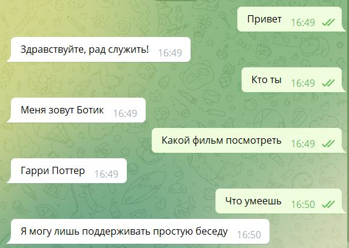

# Telegram bot for conversations and Telegram bot for classification geological files by lines.

Initially, a chat bot was made, but based on it, I made the geo bot.

There are currently few geological words in some categories, so the model is retrained towards well names.
Now the bot distinguishes 8 geological categories (geochemistry, lithological description + core, well names, sedimentary environments, paleontology, stratigraphy, subjects of the Russian Federation, tectonics) and can read text files (.txt).

If you want to use a bot, then write a 'BotFather' and create your own bot (you should add a bot key to notebook).

Chat bot example:

